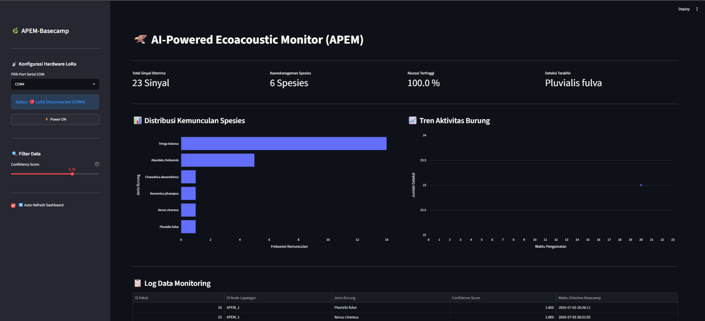

# 🦅 APEM (AI-Powered Ecoacoustic Monitor) Basecamp

**APEM-Basecamp** merupakan aplikasi berbasis web yang berfungsi sebagai pusat penerimaan, penyimpanan, dan visualisasi hasil deteksi suara burung yang dikirimkan oleh **edge device** yang menjalankan aplikasi **APEM** melalui komunikasi **LoRa**.

Berbeda dengan **edge device** yang menjalankan aplikasi **APEM** untuk melakukan *audio acquisition*, *offline inference* menggunakan model **BirdNET TensorFlow Lite (TFLite)**, serta mengirimkan hasil deteksi ke Basecamp melalui **LoRa**, **APEM Basecamp** berfokus pada penerimaan data, penyimpanan ke dalam **SQLite**, dan penyajian informasi melalui dashboard berbasis **Streamlit** secara *real-time*. Komunikasi dengan **LoRa Receiver** dilakukan menggunakan **PySerial** untuk menerima paket data dari edge device.

---

## 🖼️ Tampilan Aplikasi

### Dashboard Monitoring




---
## ✨ Fitur

- 📡 Monitoring data LoRa secara *real-time*
- 🐦 Pencatatan hasil deteksi spesies burung
- 📊 Dashboard interaktif
- 📈 Visualisasi frekuensi deteksi setiap spesies
- ⏱ Analisis waktu aktivitas burung
- 💾 Penyimpanan data menggunakan SQLite
- 🔌 Manajemen koneksi **Serial Port** untuk LoRa Receiver

---

## 🛠 Tech Stack

- Python 3.12+
- Streamlit
- SQLite
- PySerial
- Pandas
- Plotly

---

## 📂 Struktur Proyek

```text
APEM/
├── docs
├── src/
│   ├── database/
│   │   └── db_manager.py
│   ├── serial/
│   │   └── lora_listener.py
│   ├── ui/
│   │   ├── charts.py
│   │   └── components.py
│   └── utils/
├── app.py
├── requirements.txt
├── .gitignore
└── README.md
```

---
## 🚀 Instalasi

### APEM (Edge Device)

Untuk instalasi dan konfigurasi **edge device** yang menjalankan aplikasi **APEM**, silakan ikuti panduan pada repository berikut:

https://github.com/dsisme-1/APEM

---

### APEM Basecamp

Clone repository:

```bash
git clone https://github.com/dsisme-1/APEM-Basecamp.git
cd APEM-Basecamp
```

Buat **virtual environment** dan install seluruh dependency:

```bash
python -m venv .venv

# Windows
.venv\Scripts\activate

# Linux/macOS
source .venv/bin/activate

pip install -r requirements.txt
```

---

## ▶️ Menjalankan Aplikasi

Jalankan dashboard Streamlit:

```bash
streamlit run app.py
```

Selanjutnya buka alamat yang ditampilkan pada terminal (umumnya `http://localhost:8501`).

Hubungkan **LoRa Receiver** ke komputer, pilih **COM Port** yang tersedia pada dashboard, kemudian aktifkan koneksi untuk mulai menerima data dari **edge device** yang menjalankan aplikasi **APEM**.
---

## 📄 Lisensi

Proyek ini menggunakan lisensi **MIT**.

---

## 👤 Author

**David Suharjanto**
